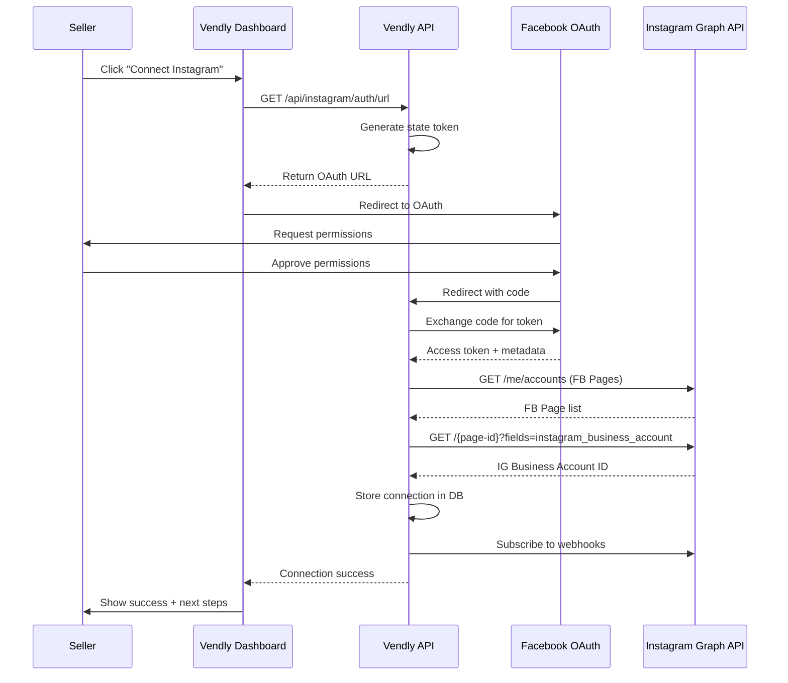
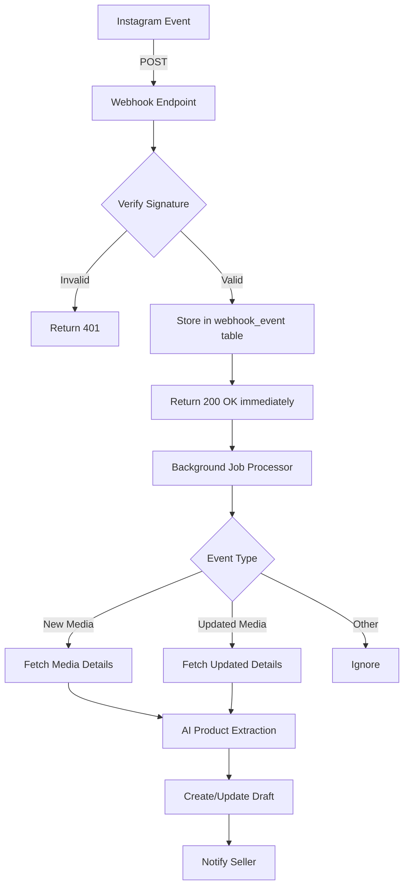
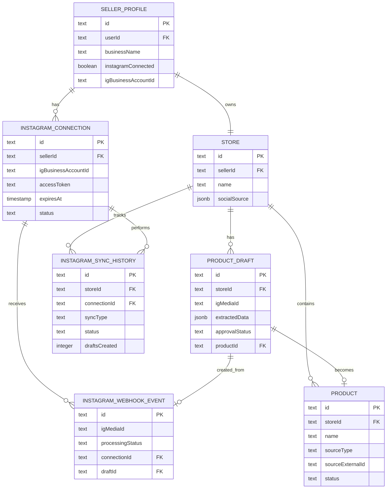

# Instagram Auto-Catalog Sync - Technical Architecture & Implementation Plan

## Executive Summary

This document outlines the technical architecture and implementation plan for the Instagram Auto-Catalog Sync feature, enabling Vendly sellers to automatically import and sync products from their Instagram Business accounts.

**Approach**: MVP-first with OpenAI/Google AI for extraction, direct webhook handling in Express, Instagram CDN URLs for images, existing PostgreSQL database with new tables, prioritizing bulk import (US-4) before real-time sync (US-2).

---

## 1. Current Architecture Analysis

### Existing Components

#### Database Layer (`packages/database`)
- **ORM**: Drizzle ORM with PostgreSQL
- **Schemas**: 
  - [`auth-schema.ts`](../packages/database/schema/auth-schema.ts) - User authentication
  - [`onboarding-schema.ts`](../packages/database/schema/onboarding-schema.ts) - Seller profiles and stores
- **Key Tables**:
  - `seller_profile` - Already has `instagramConnected`, `igBusinessAccountId`, `fbPageId` fields
  - `store` - Has `socialSource` JSONB field for tracking sync metadata

#### Type System (`packages/types`)
- [`Product`](../packages/types/src/models/Product.ts) model already includes:
  - `source` field with `type: 'instagram' | 'whatsapp_catalog' | 'manual'`
  - `externalId`, `externalUrl`, `caption`, `importedAt` metadata
  - `status: 'draft' | 'active'` for approval workflow
- [`Store`](../packages/types/src/models/Store.ts) model has `socialSource` for sync tracking

#### API Layer (`apps/api`)
- **Framework**: Express.js with TypeScript
- **Existing Services**:
  - [`import.service.ts`](../apps/api/src/services/import.service.ts) - Placeholder for Instagram/WhatsApp imports
  - [`onboarding.ts`](../apps/api/src/services/onboarding.ts) - Seller onboarding flow
  - [`store.service.ts`](../apps/api/src/services/store.service.ts) - Store management

### Integration Points Identified

1. **Seller Profile** - Already tracks Instagram connection status
2. **Product Model** - Already supports source tracking and draft status
3. **Import Service** - Has placeholder methods ready for implementation
4. **Store Service** - Has `updateSocialSource()` method for sync metadata

---

## 2. Database Schema Design

### New Tables Required

#### 2.1 `instagram_connection` Table
Stores OAuth tokens and connection metadata per seller.

```typescript
export const instagramConnection = pgTable("instagram_connection", {
  id: text("id").primaryKey(),
  sellerId: text("seller_id").notNull().references(() => sellerProfile.id, { onDelete: "cascade" }),
  
  // Instagram Business Account Details
  igBusinessAccountId: text("ig_business_account_id").notNull(),
  igUsername: text("ig_username"),
  fbPageId: text("fb_page_id").notNull(),
  fbPageName: text("fb_page_name"),
  
  // OAuth Tokens
  accessToken: text("access_token").notNull(), // Encrypted in production
  tokenType: text("token_type").default("bearer").notNull(),
  expiresAt: timestamp("expires_at").notNull(),
  
  // Permissions & Scopes
  grantedScopes: jsonb("granted_scopes").$type<string[]>().notNull(),
  
  // Connection Status
  status: text("status").default("active").notNull(), // 'active' | 'expired' | 'revoked' | 'error'
  lastValidatedAt: timestamp("last_validated_at"),
  errorMessage: text("error_message"),
  
  // Webhook Subscription
  webhookSubscribed: boolean("webhook_subscribed").default(false).notNull(),
  webhookVerifyToken: text("webhook_verify_token"),
  
  createdAt: timestamp("created_at").defaultNow().notNull(),
  updatedAt: timestamp("updated_at").defaultNow().$onUpdate(() => new Date()).notNull(),
}, (t) => [
  uniqueIndex("ig_connection_seller_uq").on(t.sellerId),
  uniqueIndex("ig_connection_ig_account_uq").on(t.igBusinessAccountId),
]);
```

#### 2.2 `product` Table (New - extends existing Product model)
Main product catalog table with Instagram sync support.

```typescript
export const product = pgTable("product", {
  id: text("id").primaryKey(),
  storeId: text("store_id").notNull().references(() => store.id, { onDelete: "cascade" }),
  
  // Basic Info
  name: text("name").notNull(),
  slug: text("slug").notNull(),
  description: text("description").notNull(),
  sku: text("sku"),
  
  // Pricing
  price: doublePrecision("price").notNull(),
  compareAtPrice: doublePrecision("compare_at_price"),
  costPerItem: doublePrecision("cost_per_item"),
  
  // Inventory
  trackInventory: boolean("track_inventory").default(true).notNull(),
  inventoryQuantity: integer("inventory_quantity").default(0).notNull(),
  allowBackorder: boolean("allow_backorder").default(false).notNull(),
  lowStockThreshold: integer("low_stock_threshold").default(5).notNull(),
  
  // Categories & Discovery
  categories: jsonb("categories").$type<string[]>().default(sql`'[]'::jsonb`).notNull(),
  tags: jsonb("tags").$type<string[]>().default(sql`'[]'::jsonb`).notNull(),
  collectionId: text("collection_id"),
  
  // Media (Instagram CDN URLs)
  images: jsonb("images").$type<string[]>().default(sql`'[]'::jsonb`).notNull(),
  videos: jsonb("videos").$type<string[]>().default(sql`'[]'::jsonb`).notNull(),
  aiGeneratedModelUrl: text("ai_generated_model_url"),
  
  // Instagram Source Metadata
  sourceType: text("source_type").default("manual").notNull(), // 'instagram' | 'whatsapp_catalog' | 'manual'
  sourceExternalId: text("source_external_id"), // Instagram media ID
  sourceExternalUrl: text("source_external_url"), // Instagram post permalink
  sourceCaption: text("source_caption"), // Original Instagram caption
  sourceImportedAt: timestamp("source_imported_at"),
  
  // Variants (MVP: false only)
  hasVariants: boolean("has_variants").default(false).notNull(),
  
  // Availability & Status
  status: text("status").default("draft").notNull(), // 'draft' | 'active'
  isActive: boolean("is_active").default(false).notNull(),
  isFeatured: boolean("is_featured").default(false).notNull(),
  isSeasonal: boolean("is_seasonal").default(false).notNull(),
  availableFrom: timestamp("available_from"),
  availableUntil: timestamp("available_until"),
  
  // SEO
  metaTitle: text("meta_title"),
  metaDescription: text("meta_description"),
  
  // Stats
  totalSold: integer("total_sold").default(0).notNull(),
  totalViews: integer("total_views").default(0).notNull(),
  totalLikes: integer("total_likes").default(0).notNull(),
  averageRating: doublePrecision("average_rating").default(0).notNull(),
  totalReviews: integer("total_reviews").default(0).notNull(),
  
  createdAt: timestamp("created_at").defaultNow().notNull(),
  updatedAt: timestamp("updated_at").defaultNow().$onUpdate(() => new Date()).notNull(),
}, (t) => [
  uniqueIndex("product_slug_store_uq").on(t.storeId, t.slug),
  index("product_store_idx").on(t.storeId),
  index("product_source_external_id_idx").on(t.sourceExternalId),
  index("product_status_idx").on(t.status),
]);
```

#### 2.3 `product_draft` Table
Temporary storage for auto-detected products awaiting seller approval.

```typescript
export const productDraft = pgTable("product_draft", {
  id: text("id").primaryKey(),
  storeId: text("store_id").notNull().references(() => store.id, { onDelete: "cascade" }),
  
  // Instagram Source
  igMediaId: text("ig_media_id").notNull(),
  igMediaUrl: text("ig_media_url").notNull(),
  igPermalink: text("ig_permalink").notNull(),
  igCaption: text("ig_caption"),
  igMediaType: text("ig_media_type").notNull(), // 'IMAGE' | 'VIDEO' | 'CAROUSEL_ALBUM'
  igTimestamp: timestamp("ig_timestamp").notNull(),
  
  // AI-Extracted Data
  extractedData: jsonb("extracted_data").$type<{
    name: string;
    description: string;
    price: number | null;
    currency: string;
    category: string | null;
    tags: string[];
    variants: Array<{ option: string; value: string }>;
    confidence: number; // 0-1 score
  }>().notNull(),
  
  // Images from Instagram
  imageUrls: jsonb("image_urls").$type<string[]>().notNull(),
  videoUrls: jsonb("video_urls").$type<string[]>().default(sql`'[]'::jsonb`).notNull(),
  
  // Approval Status
  approvalStatus: text("approval_status").default("pending").notNull(), // 'pending' | 'approved' | 'rejected' | 'expired'
  approvedAt: timestamp("approved_at"),
  rejectedAt: timestamp("rejected_at"),
  rejectionReason: text("rejection_reason"),
  
  // Seller Edits (before approval)
  sellerEdits: jsonb("seller_edits").$type<{
    name?: string;
    description?: string;
    price?: number;
    category?: string;
    tags?: string[];
  }>(),
  
  // Linked Product (after approval)
  productId: text("product_id").references(() => product.id, { onDelete: "set null" }),
  
  // Expiration (auto-delete after 7 days)
  expiresAt: timestamp("expires_at").notNull(),
  
  createdAt: timestamp("created_at").defaultNow().notNull(),
  updatedAt: timestamp("updated_at").defaultNow().$onUpdate(() => new Date()).notNull(),
}, (t) => [
  uniqueIndex("product_draft_ig_media_uq").on(t.igMediaId),
  index("product_draft_store_idx").on(t.storeId),
  index("product_draft_status_idx").on(t.approvalStatus),
  index("product_draft_expires_idx").on(t.expiresAt),
]);
```

#### 2.4 `instagram_sync_history` Table
Audit log for all sync operations.

```typescript
export const instagramSyncHistory = pgTable("instagram_sync_history", {
  id: text("id").primaryKey(),
  storeId: text("store_id").notNull().references(() => store.id, { onDelete: "cascade" }),
  connectionId: text("connection_id").notNull().references(() => instagramConnection.id, { onDelete: "cascade" }),
  
  // Sync Operation
  syncType: text("sync_type").notNull(), // 'bulk_import' | 'incremental_sync' | 'webhook_trigger' | 'manual_refresh'
  triggerSource: text("trigger_source").notNull(), // 'user_initiated' | 'webhook' | 'scheduled_job'
  
  // Results
  status: text("status").notNull(), // 'success' | 'partial_success' | 'failed'
  totalProcessed: integer("total_processed").default(0).notNull(),
  draftsCreated: integer("drafts_created").default(0).notNull(),
  productsImported: integer("products_imported").default(0).notNull(),
  productsUpdated: integer("products_updated").default(0).notNull(),
  productsSkipped: integer("products_skipped").default(0).notNull(),
  productsFailed: integer("products_failed").default(0).notNull(),
  
  // Error Details
  errors: jsonb("errors").$type<Array<{
    mediaId: string;
    error: string;
    timestamp: string;
  }>>().default(sql`'[]'::jsonb`).notNull(),
  
  // Performance Metrics
  durationMs: integer("duration_ms"),
  apiCallsUsed: integer("api_calls_used"),
  
  // Metadata
  metadata: jsonb("metadata").$type<{
    mediaIdsProcessed?: string[];
    oldestMediaTimestamp?: string;
    newestMediaTimestamp?: string;
  }>(),
  
  startedAt: timestamp("started_at").notNull(),
  completedAt: timestamp("completed_at"),
  createdAt: timestamp("created_at").defaultNow().notNull(),
}, (t) => [
  index("sync_history_store_idx").on(t.storeId),
  index("sync_history_created_idx").on(t.createdAt),
]);
```

#### 2.5 `instagram_webhook_event` Table
Stores incoming webhook events for processing.

```typescript
export const instagramWebhookEvent = pgTable("instagram_webhook_event", {
  id: text("id").primaryKey(),
  
  // Webhook Metadata
  webhookId: text("webhook_id").notNull(), // From Instagram
  eventType: text("event_type").notNull(), // 'media' | 'comments' | 'mentions'
  field: text("field").notNull(), // 'media' for product posts
  
  // Instagram Data
  igUserId: text("ig_user_id").notNull(),
  igMediaId: text("ig_media_id"),
  
  // Payload
  rawPayload: jsonb("raw_payload").notNull(),
  
  // Processing Status
  processingStatus: text("processing_status").default("pending").notNull(), // 'pending' | 'processing' | 'completed' | 'failed' | 'ignored'
  processedAt: timestamp("processed_at"),
  processingError: text("processing_error"),
  retryCount: integer("retry_count").default(0).notNull(),
  
  // Linked Records
  connectionId: text("connection_id").references(() => instagramConnection.id, { onDelete: "set null" }),
  draftId: text("draft_id").references(() => productDraft.id, { onDelete: "set null" }),
  
  receivedAt: timestamp("received_at").defaultNow().notNull(),
  createdAt: timestamp("created_at").defaultNow().notNull(),
}, (t) => [
  index("webhook_event_status_idx").on(t.processingStatus),
  index("webhook_event_ig_media_idx").on(t.igMediaId),
  index("webhook_event_received_idx").on(t.receivedAt),
]);
```

---

## 3. Instagram OAuth & Webhook Architecture

### 3.1 OAuth Flow (US-1: Instagram Business Account Connection)



**Required Permissions**:
- `instagram_basic`
- `instagram_content_publish`
- `pages_show_list`
- `pages_read_engagement`
- `business_management`

### 3.2 Webhook Infrastructure

#### Webhook Endpoint Structure
```
POST /api/webhooks/instagram
  - Verification (GET): Responds to Facebook's verification challenge
  - Event Processing (POST): Receives and queues Instagram events
```

#### Webhook Event Flow


**Key Design Decisions**:
1. **Immediate Response**: Return 200 OK within 5 seconds to avoid Instagram retries
2. **Async Processing**: Store event and process in background
3. **Idempotency**: Check for duplicate events using `webhookId` + `igMediaId`
4. **Retry Logic**: Exponential backoff for failed processing (max 3 retries)

---

## 4. AI/ML Product Extraction Architecture

### 4.1 Extraction Service Design

```typescript
// packages/ai-catalog/src/instagram-extractor.ts

interface InstagramMediaData {
  id: string;
  caption: string;
  media_type: 'IMAGE' | 'VIDEO' | 'CAROUSEL_ALBUM';
  media_url: string;
  permalink: string;
  timestamp: string;
  children?: { data: Array<{ media_url: string }> };
}

interface ExtractedProductData {
  name: string;
  description: string;
  price: number | null;
  currency: string;
  category: string | null;
  tags: string[];
  variants: Array<{ option: string; value: string }>;
  confidence: number; // 0-1
}

class InstagramProductExtractor {
  private openaiClient: OpenAI;
  private googleAIClient: GoogleGenerativeAI;
  
  async extractProduct(media: InstagramMediaData): Promise<ExtractedProductData> {
    // Step 1: Caption Analysis (OpenAI GPT-4)
    const captionAnalysis = await this.analyzeCaptionWithOpenAI(media.caption);
    
    // Step 2: Image Analysis (Google Vision API for categorization)
    const imageAnalysis = await this.analyzeImageWithGoogle(media.media_url);
    
    // Step 3: Merge Results
    return this.mergeExtractionResults(captionAnalysis, imageAnalysis);
  }
  
  private async analyzeCaptionWithOpenAI(caption: string): Promise<Partial<ExtractedProductData>> {
    const prompt = `
      Analyze this Instagram product caption and extract:
      1. Product name
      2. Description
      3. Price (look for KES, UGX, USD, or numeric patterns)
      4. Product tags/keywords
      5. Variants (sizes, colors, etc.)
      
      Caption: "${caption}"
      
      Return JSON format:
      {
        "name": "string",
        "description": "string",
        "price": number | null,
        "currency": "KES" | "UGX" | "USD",
        "tags": ["string"],
        "variants": [{"option": "size", "value": "M"}],
        "confidence": 0.0-1.0
      }
    `;
    
    const response = await this.openaiClient.chat.completions.create({
      model: "gpt-4-turbo-preview",
      messages: [{ role: "user", content: prompt }],
      response_format: { type: "json_object" },
      temperature: 0.3,
    });
    
    return JSON.parse(response.choices[0].message.content);
  }
  
  private async analyzeImageWithGoogle(imageUrl: string): Promise<{ category: string; confidence: number }> {
    // Use Google Vision API for product categorization
    const model = this.googleAIClient.getGenerativeModel({ model: "gemini-1.5-flash" });
    
    const prompt = `
      Categorize this product image into one of these categories:
      - Fashion & Apparel
      - Electronics & Gadgets
      - Home & Living
      - Beauty & Personal Care
      - Food & Beverages
      - Sports & Fitness
      - Books & Media
      - Toys & Games
      - Other
      
      Return JSON: {"category": "string", "confidence": 0.0-1.0}
    `;
    
    const result = await model.generateContent([
      prompt,
      { inlineData: { data: await this.fetchImageAsBase64(imageUrl), mimeType: "image/jpeg" } }
    ]);
    
    return JSON.parse(result.response.text());
  }
  
  private mergeExtractionResults(
    captionData: Partial<ExtractedProductData>,
    imageData: { category: string; confidence: number }
  ): ExtractedProductData {
    return {
      name: captionData.name || "Untitled Product",
      description: captionData.description || "",
      price: captionData.price,
      currency: captionData.currency || "KES",
      category: imageData.category,
      tags: captionData.tags || [],
      variants: captionData.variants || [],
      confidence: Math.min(captionData.confidence || 0.5, imageData.confidence),
    };
  }
}
```

### 4.2 AI Service Integration Points

**OpenAI Usage**:
- **Model**: GPT-4 Turbo (for caption parsing)
- **Cost**: ~$0.01 per product extraction
- **Rate Limit**: 10,000 requests/day (Tier 1)

**Google AI Usage**:
- **Model**: Gemini 1.5 Flash (for image categorization)
- **Cost**: ~$0.0001 per image
- **Rate Limit**: 1,500 requests/minute

**Fallback Strategy**:
- If AI extraction fails, create draft with raw caption as description
- Set confidence to 0.0 to flag for manual review
- Log error for monitoring

---

## 5. API Endpoint Specifications

### 5.1 Instagram Connection Endpoints

#### `GET /api/instagram/auth/url`
Generate Instagram OAuth URL for seller to authorize.

**Response**:
```json
{
  "authUrl": "https://www.facebook.com/v20.0/dialog/oauth?...",
  "state": "random_state_token"
}
```

#### `GET /api/instagram/auth/callback`
Handle OAuth callback and store connection.

**Query Params**: `code`, `state`

**Response**:
```json
{
  "success": true,
  "connection": {
    "id": "igc_abc123",
    "igUsername": "seller_store",
    "status": "active"
  }
}
```

#### `GET /api/instagram/connection`
Get current Instagram connection status.

**Response**:
```json
{
  "connected": true,
  "connection": {
    "id": "igc_abc123",
    "igUsername": "seller_store",
    "igBusinessAccountId": "123456789",
    "status": "active",
    "lastValidatedAt": "2025-10-10T10:00:00Z",
    "webhookSubscribed": true
  }
}
```

#### `DELETE /api/instagram/connection`
Disconnect Instagram account.

**Response**:
```json
{
  "success": true,
  "message": "Instagram account disconnected"
}
```

### 5.2 Bulk Import Endpoints (US-4)

#### `POST /api/instagram/scan`
Scan Instagram for products (initial bulk import).

**Request**:
```json
{
  "limit": 100,
  "includeVideos": false
}
```

**Response**:
```json
{
  "scanId": "scan_xyz789",
  "status": "processing",
  "estimatedTime": 180
}
```

#### `GET /api/instagram/scan/:scanId`
Get scan progress and results.

**Response**:
```json
{
  "scanId": "scan_xyz789",
  "status": "completed",
  "progress": {
    "totalMedia": 50,
    "processed": 50,
    "draftsCreated": 42,
    "failed": 8
  },
  "drafts": [
    {
      "id": "draft_123",
      "igMediaId": "ig_456",
      "extractedData": {
        "name": "Blue Denim Jacket",
        "price": 2500,
        "currency": "KES",
        "confidence": 0.92
      },
      "imageUrls": ["https://..."],
      "createdAt": "2025-10-10T10:00:00Z"
    }
  ]
}
```

### 5.3 Draft Management Endpoints (US-6)

#### `GET /api/products/drafts`
List all pending product drafts.

**Query Params**: `page`, `limit`, `status`

**Response**:
```json
{
  "drafts": [
    {
      "id": "draft_123",
      "igMediaUrl": "https://instagram.com/p/...",
      "extractedData": { ... },
      "imageUrls": ["https://..."],
      "approvalStatus": "pending",
      "expiresAt": "2025-10-17T10:00:00Z",
      "createdAt": "2025-10-10T10:00:00Z"
    }
  ],
  "pagination": {
    "total": 42,
    "page": 1,
    "limit": 20,
    "pages": 3
  }
}
```

#### `PATCH /api/products/drafts/:draftId`
Edit draft before approval.

**Request**:
```json
{
  "name": "Updated Product Name",
  "price": 3000,
  "description": "Updated description",
  "category": "Fashion & Apparel",
  "tags": ["denim", "jacket", "blue"]
}
```

**Response**:
```json
{
  "success": true,
  "draft": { ... }
}
```

#### `POST /api/products/drafts/:draftId/approve`
Approve draft and create product.

**Response**:
```json
{
  "success": true,
  "product": {
    "id": "prd_789",
    "name": "Blue Denim Jacket",
    "status": "active",
    "slug": "blue-denim-jacket"
  }
}
```

#### `POST /api/products/drafts/:draftId/reject`
Reject draft.

**Request**:
```json
{
  "reason": "Not a product / Duplicate / Other"
}
```

**Response**:
```json
{
  "success": true,
  "message": "Draft rejected"
}
```

#### `POST /api/products/drafts/batch-approve`
Approve multiple drafts at once.

**Request**:
```json
{
  "draftIds": ["draft_123", "draft_456", "draft_789"]
}
```

**Response**:
```json
{
  "success": true,
  "results": {
    "approved": 3,
    "failed": 0
  },
  "products": [...]
}
```

### 5.4 Webhook Endpoint

#### `GET /api/webhooks/instagram`
Webhook verification (Facebook requirement).

**Query Params**: `hub.mode`, `hub.verify_token`, `hub.challenge`

**Response**: Echo `hub.challenge`

#### `POST /api/webhooks/instagram`
Receive Instagram webhook events.

**Request** (from Instagram):
```json
{
  "object": "instagram",
  "entry": [
    {
      "id": "ig_user_id",
      "time": 1234567890,
      "changes": [
        {
          "field": "media",
          "value": {
            "media_id": "ig_media_id"
          }
        }
      ]
    }
  ]
}
```

**Response**: `200 OK` (immediate)

### 5.5 Sync History Endpoint

#### `GET /api/instagram/sync-history`
Get sync operation history.

**Query Params**: `page`, `limit`

**Response**:
```json
{
  "history": [
    {
      "id": "sync_123",
      "syncType": "bulk_import",
      "status": "success",
      "totalProcessed": 50,
      "draftsCreated": 42,
      "productsImported": 38,
      "startedAt": "2025-10-10T10:00:00Z",
      "completedAt": "2025-10-10T10:03:00Z",
      "durationMs": 180000
    }
  ],
  "pagination": { ... }
}
```

---

## 6. Frontend UI/UX Flows

### 6.1 Instagram Connection Flow (Seller Dashboard)

**Location**: `/dashboard/settings/integrations`

```
┌─────────────────────────────────────────┐
│  Instagram Integration                   │
├─────────────────────────────────────────┤
│                                          │
│  [Instagram Icon]                        │
│  Connect your Instagram Business account │
│  to automatically import products        │
│                                          │
│  Benefits:                               │
│  ✓ Import products in minutes           │
│  ✓ Auto-sync new posts                  │
│  ✓ Keep inventory up-to-date            │
│                                          │
│  [ Connect Instagram Account ]          │
│                                          │
└─────────────────────────────────────────┘
```

**After Connection**:
```
┌─────────────────────────────────────────┐
│  Instagram Integration          ✓ Active │
├─────────────────────────────────────────┤
│                                          │
│  Connected Account: @seller_store        │
│  Last Synced: 2 hours ago               │
│  Products Imported: 42                   │
│                                          │
│  [ Scan for New Products ]              │
│  [ Disconnect Account ]                 │
│                                          │
└─────────────────────────────────────────┘
```

### 6.2 Bulk Import Flow

**Step 1: Initiate Scan**
```
┌─────────────────────────────────────────┐
│  Import Products from Instagram         │
├─────────────────────────────────────────┤
│                                          │
│  We'll scan your Instagram posts and    │
│  detect products automatically.          │
│                                          │
│  Options:                                │
│  ☑ Include carousel posts               │
│  ☐ Include video posts                  │
│  ☑ Only posts from last 6 months        │
│                                          │
│  [ Start Scan ]  [ Cancel ]             │
│                                          │
└─────────────────────────────────────────┘
```

**Step 2: Scanning Progress**
```
┌─────────────────────────────────────────┐
│  Scanning Instagram...                   │
├─────────────────────────────────────────┤
│                                          │
│  ████████████░░░░░░░░░░░░░░░░░░  42/50  │
│                                          │
│  Analyzing posts with AI...             │
│  Estimated time: 2 minutes              │
│                                          │
└─────────────────────────────────────────┘
```

**Step 3: Review Detected Products**
```
┌─────────────────────────────────────────┐
│  Review Detected Products (42 found)    │
├─────────────────────────────────────────┤
│                                          │
│  [ Select All ]  [ Import Selected ]    │
│                                          │
│  ┌─────────────────────────────────┐   │
│  │ ☑ [Image] Blue Denim Jacket     │   │
│  │   KES 2,500 • 92% confidence    │   │
│  │   [ Edit ] [ View Post ]        │   │
│  └─────────────────────────────────┘   │
│                                          │
│  ┌─────────────────────────────────┐   │
│  │ ☑ [Image] Red Sneakers          │   │
│  │   KES 3,200 • 88% confidence    │   │
│  │   [ Edit ] [ View Post ]        │   │
│  └─────────────────────────────────┘   │
│                                          │
│  ... (40 more)                          │
│                                          │
└─────────────────────────────────────────┘
```

### 6.3 Draft Approval Workflow

**Location**: `/dashboard/products/drafts`

```
┌─────────────────────────────────────────┐
│  Pending Product Drafts (12)            │
├─────────────────────────────────────────┤
│                                          │
│  Filters: [ All ] [ High Confidence ]   │
│           [ Low Confidence ] [ Expiring ]│
│                                          │
│  ┌─────────────────────────────────┐   │
│  │ [Image Grid]                     │   │
│  │ Blue Denim Jacket                │   │
│  │ KES 2,500 • 92% confidence       │   │
│  │ Expires in 5 days                │   │
│  │                                   │   │
│  │ [ ✓ Approve ] [ ✗ Reject ]       │   │
│  │ [ ✏ Edit Details ]               │   │
│  └─────────────────────────────────┘   │
│                                          │
│  ... (11 more)                          │
│                                          │
└─────────────────────────────────────────┘
```

**Edit Draft Modal**:
```
┌─────────────────────────────────────────┐
│  Edit Product Details              [X]  │
├─────────────────────────────────────────┤
│                                          │
│  [Image Preview]                        │
│                                          │
│  Product Name *                         │
│  [Blue Denim Jacket____________]        │
│                                          │
│  Price (KES) *                          │
│  [2500_____]                            │
│                                          │
│  Description                            │
│  [Stylish blue denim jacket...]         │
│                                          │
│  Category                               │
│  [Fashion & Apparel ▼]                  │
│                                          │
│  Tags                                   │
│  [denim] [jacket] [blue] [+ Add]        │
│                                          │
│  [ Save & Approve ]  [ Save Draft ]     │
│                                          │
└─────────────────────────────────────────┘
```

### 6.4 Real-Time Notifications

**In-App Notification**:
```
┌─────────────────────────────────────────┐
│  🔔 New product detected from Instagram │
│                                          │
│  "Blue Denim Jacket" was detected from  │
│  your latest Instagram post.            │
│                                          │
│  [ Review Now ]  [ Dismiss ]            │
└─────────────────────────────────────────┘
```

**Push Notification** (Mobile):
```
Vendly
New product detected! 🎉
"Blue Denim Jacket" from your Instagram post
Tap to review and approve
```

---

## 7. Rate Limiting & Scalability Strategy

### 7.1 Instagram Graph API Rate Limits

**Current Limits** (Standard Access):
- 200 calls per hour per user
- 4,800 calls per day per app

**Strategy**:
1. **Batch Requests**: Use batch API to fetch multiple media in one call
2. **Caching**: Cache media metadata for 1 hour
3. **Pagination**: Fetch 25 media per request (optimal batch size)
4. **Throttling**: Implement exponential backoff on rate limit errors

### 7.2 AI Service Rate Limits

**OpenAI**:
- Tier 1: 10,000 requests/day, 500 requests/minute
- **Strategy**: Queue extraction jobs, process 100 products/minute

**Google AI**:
- 1,500 requests/minute
- **Strategy**: Parallel processing with 1000 req/min limit

### 7.3 Database Scalability

**Indexing Strategy**:
- Index on `sourceExternalId` for duplicate detection
- Index on `status` for draft queries
- Index on `storeId` for seller-specific queries
- Composite index on `(storeId, status)` for filtered lists

**Partitioning** (Future):
- Partition `product` table by `storeId` when > 1M products
- Partition `instagram_sync_history` by `createdAt` (monthly)

### 7.4 Webhook Processing Scalability

**Current Approach** (MVP):
- Direct processing in Express route handler
- Background job queue using in-memory queue

**Future Enhancement**:
- Redis-backed queue (Bull/BullMQ)
- Separate worker processes
- Horizontal scaling with load balancer

---

## 8. Monitoring & Error Handling

### 8.1 Error Categories

#### 8.1.1 Instagram API Errors
- **Rate Limit Exceeded**: Retry with exponential backoff
- **Invalid Token**: Notify seller to reconnect
- **Permission Denied**: Log and notify seller
- **Media Not Found**: Skip and log

#### 8.1.2 AI Extraction Errors
- **OpenAI Timeout**: Retry up to 3 times
- **Invalid Response**: Use fallback (raw caption)
- **Low Confidence (<0.5)**: Flag for manual review

#### 8.1.3 Database Errors
- **Duplicate Key**: Skip (already imported)
- **Connection Error**: Retry with backoff
- **Constraint Violation**: Log and skip

### 8.2 Monitoring Metrics

**Key Metrics to Track**:
1. **Sync Success Rate**: % of successful syncs
2. **AI Extraction Accuracy**: % of products requiring edits
3. **Draft Approval Rate**: % of drafts approved vs rejected
4. **Time to Import**: Average time from scan to approval
5. **API Call Usage**: Instagram API calls per day
6. **Error Rate**: Errors per 1000 operations

**Alerting Thresholds**:
- Sync success rate < 90%
- AI extraction accuracy < 80%
- Error rate > 5%
- Instagram API rate limit hit

### 8.3 Logging Strategy

**Log Levels**:
- **INFO**: Successful operations, sync completions
- **WARN**: Low confidence extractions, retries
- **ERROR**: Failed operations, API errors
- **DEBUG**: Detailed extraction results (dev only)

**Log Structure**:
```json
{
  "timestamp": "2025-10-10T10:00:00Z",
  "level": "INFO",
  "service": "instagram-sync",
  "operation": "bulk_import",
  "storeId": "str_123",
  "duration": 180000,
  "metrics": {
    "totalProcessed": 50,
    "draftsCreated": 42,
    "failed": 8
  }
}
```

---

## 9. Implementation Roadmap

### Sprint 1: Foundation (13 points) - Week 1-2

**Goal**: Set up database schema and Instagram OAuth

#### Tasks:
1. **Database Schema** (5 points)
   - Create migration for all 5 new tables
   - Add indexes and constraints
   - Update Drizzle schema files
   - Test migrations on dev database

2. **Instagram OAuth Flow** (8 points)
   - Implement OAuth endpoints (`/auth/url`, `/auth/callback`)
   - Store connection in `instagram_connection` table
   - Token refresh mechanism
   - Connection status validation
   - Unit tests for OAuth flow

**Deliverables**:
- ✅ Database schema deployed
- ✅ Instagram connection working in dev
- ✅ OAuth flow tested end-to-end

---

### Sprint 2: AI Extraction Service (13 points) - Week 3-4

**Goal**: Build AI-powered product extraction

#### Tasks:
1. **AI Service Package** (8 points)
   - Create `packages/ai-catalog` package
   - Implement OpenAI caption parser
   - Implement Google Vision image categorizer
   - Result merging logic
   - Error handling and fallbacks

2. **Instagram Media Fetcher** (5 points)
   - Implement Instagram Graph API client
   - Fetch media with pagination
   - Handle carousel albums
   - Rate limit handling
   - Unit tests

**Deliverables**:
- ✅ AI extraction service working
- ✅ 90%+ accuracy on test dataset
- ✅ Instagram media fetching functional

---

### Sprint 3: Bulk Import (US-4) (13 points) - Week 5-6

**Goal**: Complete bulk import flow

#### Tasks:
1. **Scan & Import API** (8 points)
   - Implement `/instagram/scan` endpoint
   - Background job for processing
   - Create drafts from extracted data
   - Progress tracking
   - Error handling

2. **Draft Management API** (5 points)
   - Implement draft CRUD endpoints
   - Batch approval endpoint
   - Draft expiration logic (7 days)
   - Unit and integration tests

**Deliverables**:
- ✅ Bulk import working end-to-end
- ✅ Drafts created and manageable
- ✅ API tests passing

---

### Sprint 4: Frontend UI (8 points) - Week 7-8

**Goal**: Build seller dashboard UI

#### Tasks:
1. **Connection UI** (3 points)
   - Instagram connection page
   - OAuth redirect handling
   - Connection status display

2. **Bulk Import UI** (5 points)
   - Scan initiation page
   - Progress indicator
   - Draft review grid
   - Edit draft modal
   - Batch approval UI

**Deliverables**:
- ✅ Complete UI for bulk import
- ✅ Responsive design
- ✅ User testing completed

---

### Sprint 5: Webhook Infrastructure (8 points) - Week 9-10

**Goal**: Enable real-time sync (US-2)

#### Tasks:
1. **Webhook Endpoint** (5 points)
   - Implement webhook verification
   - Event storage in database
   - Signature validation
   - Idempotency handling

2. **Webhook Processing** (3 points)
   - Background job processor
   - Event-to-draft pipeline
   - Notification system integration
   - Error handling and retries

**Deliverables**:
- ✅ Webhooks receiving events
- ✅ Real-time draft creation working
- ✅ Notifications sent to sellers

---

### Sprint 6: Approval Workflow (US-6) (5 points) - Week 11

**Goal**: Polish draft approval experience

#### Tasks:
1. **Approval Features** (5 points)
   - One-click approve from notification
   - Batch approval improvements
   - Auto-approve toggle (for trusted sellers)
   - Draft expiration reminders
   - Approval analytics

**Deliverables**:
- ✅ Streamlined approval workflow
- ✅ Auto-approve feature working
- ✅ Analytics dashboard

---

### Sprint 7: Bi-Directional Sync (US-5) (8 points) - Week 12-13

**Goal**: Enable edit synchronization

#### Tasks:
1. **Sync Logic** (5 points)
   - Detect Instagram post edits
   - Compare with Vendly product data
   - Conflict detection algorithm
   - Update product fields

2. **Conflict Resolution UI** (3 points)
   - Conflict notification
   - Side-by-side comparison view
   - Manual resolution interface
   - Sync history display

**Deliverables**:
- ✅ Edit sync working
- ✅ Conflict resolution functional
- ✅ Sync history visible

---

### Sprint 8: Polish & Launch (5 points) - Week 14

**Goal**: Production readiness

#### Tasks:
1. **Production Prep** (5 points)
   - Security audit (token encryption)
   - Performance optimization
   - Error monitoring setup
   - Documentation
   - Load testing
   - Beta user testing

**Deliverables**:
- ✅ Production deployment
- ✅ Monitoring dashboards live
- ✅ Documentation complete
- ✅ Beta users onboarded

---

## 10. Success Metrics & KPIs

### Phase 1 (Weeks 1-8): MVP Launch
- **Target**: 50 beta sellers using Instagram sync
- **Onboarding Speed**: 90% complete sync in < 5 minutes
- **AI Accuracy**: 85%+ products require zero edits
- **Sync Reliability**: 99%+ uptime

### Phase 2 (Weeks 9-14): Full Launch
- **Target**: 500 sellers using Instagram sync
- **Adoption Rate**: 70%+ of new sellers use Instagram sync
- **Time Saved**: 45 minutes average per seller
- **Draft Approval Rate**: 80%+ drafts approved

### Long-term (3 months post-launch)
- **Target**: 2,000+ sellers syncing
- **Real-time Sync**: 95%+ of new posts synced within 2 minutes
- **Seller Satisfaction**: 4.5+ star rating for feature
- **Revenue Impact**: 30% increase in seller onboarding

---

## 11. Risk Mitigation

### Technical Risks

1. **Instagram API Changes**
   - **Risk**: API deprecation or breaking changes
   - **Mitigation**: Version pinning, monitoring Facebook changelog, fallback to manual import

2. **AI Extraction Accuracy**
   - **Risk**: Low accuracy on certain product types
   - **Mitigation**: Confidence scoring, manual review for low confidence, continuous model improvement

3. **Rate Limiting**
   - **Risk**: Hitting Instagram API limits during peak usage
   - **Mitigation**: Queuing system, batch processing, seller communication about limits

4. **Webhook Reliability**
   - **Risk**: Missed webhook events
   - **Mitigation**: Periodic polling as backup, event deduplication, retry logic

### Business Risks

1. **Low Adoption**
   - **Risk**: Sellers don't use the feature
   - **Mitigation**: Onboarding tutorial, success stories, incentives for first sync

2. **High Support Load**
   - **Risk**: Many support tickets for connection issues
   - **Mitigation**: Comprehensive documentation, in-app help, automated troubleshooting

3. **Data Privacy Concerns**
   - **Risk**: Sellers worried about data access
   - **Mitigation**: Clear permission explanations, data usage transparency, easy disconnect

---

## 12. Next Steps

### Immediate Actions (This Week)
1. ✅ Review and approve this architecture document
2. Create database migration files
3. Set up Facebook App for OAuth
4. Initialize `packages/ai-catalog` package
5. Set up OpenAI and Google AI API keys

### Week 1 Kickoff
1. Sprint 1 planning meeting
2. Assign tasks to team members
3. Set up development environment
4. Create feature branch: `feature/instagram-auto-catalog`
5. Daily standups to track progress

### Questions for Product Team
1. Should we support Instagram Creator accounts or only Business accounts?
2. What's the priority order for product categories?
3. Should we auto-publish approved products or keep them as drafts?
4. What's the desired behavior for duplicate products (same Instagram post imported twice)?
5. Should we support multi-language captions (Swahili, English)?

---

## Appendix A: Technology Stack Summary

| Component | Technology | Purpose |
|-----------|-----------|---------|
| Database | PostgreSQL + Drizzle ORM | Data persistence |
| API | Express.js + TypeScript | Backend services |
| AI - Caption | OpenAI GPT-4 Turbo | Product extraction from text |
| AI - Image | Google Gemini 1.5 Flash | Image categorization |
| OAuth | Facebook OAuth 2.0 | Instagram authentication |
| Webhooks | Express routes | Real-time event handling |
| Frontend | Next.js + React | Seller dashboard |
| Queue | In-memory (MVP) → Bull (future) | Background job processing |
| Monitoring | (TBD) | Error tracking and metrics |

---

## Appendix B: Instagram Graph API Endpoints Used

| Endpoint | Purpose | Rate Limit |
|----------|---------|------------|
| `GET /{ig-user-id}/media` | Fetch user's media | 200/hour |
| `GET /{media-id}` | Get media details | 200/hour |
| `GET /{media-id}/children` | Get carousel items | 200/hour |
| `GET /me/accounts` | Get FB pages | 200/hour |
| `GET /{page-id}?fields=instagram_business_account` | Get IG account | 200/hour |
| `POST /{ig-user-id}/subscribed_apps` | Subscribe to webhooks | N/A |

---

## Appendix C: Database ERD



---

**Document Version**: 1.0  
**Last Updated**: 2025-10-10  
**Author**: Kilo Code (Architect Mode)  
**Status**: Ready for Review