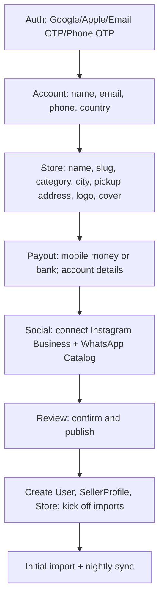
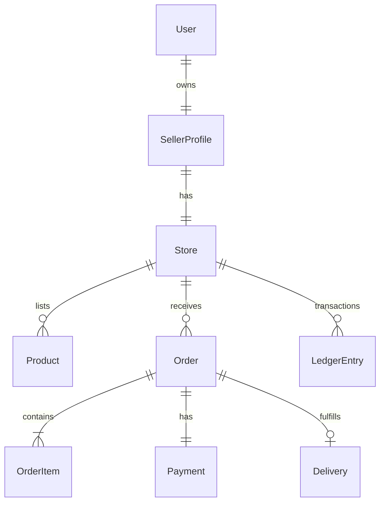

# Vendly MVP: Seller Setup and Store Creation

Status: Approved scope for KE and UG, English-only v1. Merchant of Record: Vendly. Payments: Flutterwave. Delivery: Sendy KE, UG manual. COD v2.

Links to current types
- [interface User()](packages/types/src/models/User.ts:3)
- [interface SellerProfile()](packages/types/src/models/Seller.ts:3)
- [interface Store()](packages/types/src/models/Store.ts:1)
- [enum NotificationType()](packages/types/src/enums/index.ts:49)
- [interface CreateStoreRequest()](packages/types/src/dtos/Store.ts:1)
- [interface UpdateStoreRequest()](packages/types/src/dtos/Store.ts:11)

---

1. Scope
- v1 includes: Auth (Google, Apple, Email OTP, Phone OTP), comprehensive onboarding, one store per seller, marketplace listing default ON, IG Business import, WhatsApp Business Catalog import, online checkout via Flutterwave, Sendy KE, payouts daily EOD, WhatsApp notifications.
- v1 excludes: cash-on-delivery, multi-store, product variants, advanced KYC, escrow/holds, courier integrations in UG.

2. High-level flows

2.1 Seller onboarding (Account → Store → Payout → Social → Review → Publish)


2.2 Checkout, payment, delivery
```mermaid
flowchart TD
A[Buyer Checkout] --> B[Buyer details + shipping method + rate]
B --> C[Initialize Flutterwave payment]
C --> D[Webhook verify -> success/fail]
D -->|Success| E[Order Paid]
D -->|Fail| F[Payment Failed -> order pending/cancel]
E --> G[Sendy booking (KE) or manual (UG)]
G --> H[Delivery updates via webhooks]
H --> I[Notifications via WhatsApp templates]
```

3. Data model (ERD)

Entities (simplified)
- User 1—1 SellerProfile; SellerProfile 1—1 Store
- Store 1—N Product; Store 1—N Order; Store 1—N Follower
- Order 1—N OrderItem; Order 1—1 Payment; Order 0—1 Delivery
- Ledger records transactions (CHARGE, FEES, PAYOUT) per store



3.1 Proposed model deltas (to be implemented next)
- [interface User()](packages/types/src/models/User.ts:3)
  - Add: authProviders: ('google'|'apple'|'email_otp'|'phone_otp')[]
  - Add: googleId?: string, appleId?: string
  - Add: emailOTPEnabled: boolean, phoneOTPEnabled: boolean

- [interface SellerProfile()](packages/types/src/models/Seller.ts:3)
  - Add: country: 'KE'|'UG', city: string, pickupAddress: string
  - Add: whatsappPhone: string, instagramConnected: boolean, igBusinessAccountId?: string, fbPageId?: string, waCatalogId?: string
  - Add: payoutMethod: 'mobile_money'|'bank'
  - Replace payout fields with payoutDetails:
    - mobileMoney?: { provider: 'mpesa'|'airtel'|'mtn', phone: string }
    - bank?: { accountName: string, accountNumber: string, bankName: string, branch?: string, swift?: string }
  - Defaults: tier=FREE, verificationStatus=PENDING

- [interface Store()](packages/types/src/models/Store.ts:1)
  - Add: currency: 'KES'|'UGX'
  - Add: marketplaceListed: boolean (default true)
  - Add: pickupAddress: string
  - Add: socialSource?: { instagram?: { lastSyncAt?: Date, importedCount: number }, whatsappCatalog?: { lastSyncAt?: Date, importedCount: number } }

- [interface CreateStoreRequest()](packages/types/src/dtos/Store.ts:1)
  - Require: name, slug, country, city, pickupAddress, primaryCategory
  - Optional: description, logoUrl, bannerUrl, templateId, primaryColor, secondaryColor, marketplaceListed

4. API contracts

4.1 Auth
- POST /auth/social/google
  - Body: { idToken: string }
  - Response: { userId: string, accessToken: string, refreshToken: string }
- POST /auth/social/apple
  - Body: { idToken: string }
  - Response: { userId: string, accessToken: string, refreshToken: string }
- POST /auth/otp/email
  - Body: { email: string }
  - Response: { sent: true }
- POST /auth/otp/phone
  - Body: { phoneNumber: string }
  - Response: { sent: true }
- POST /auth/otp/verify
  - Body: { code: string, method: 'email'|'phone' }
  - Response: { userId: string, accessToken: string, refreshToken: string }

4.2 Onboarding
- POST /seller-profiles
  - Body: {
      account: { fullName: string, email: string, phone: string, country: 'KE'|'UG' },
      store: { name: string, slug: string, primaryCategory: string, city: string, pickupAddress: string, description?: string, logoUrl?: string, bannerUrl?: string, templateId?: string, primaryColor?: string, secondaryColor?: string, marketplaceListed?: boolean },
      payout: { method: 'mobile_money'|'bank', mobileMoney?: { provider: 'mpesa'|'airtel'|'mtn', phone: string }, bank?: { accountName: string, accountNumber: string, bankName: string, branch?: string, swift?: string } },
      social: { instagram: boolean, whatsappCatalog: boolean }
    }
  - Response: { sellerProfileId: string, storeId: string, storeSlug: string }
- GET /seller-profiles/:id
- PUT /seller-profiles/:id

4.3 Store
- POST /stores
  - Body: CreateStoreRequest
  - Response: Store
- GET /stores/:id
- PUT /stores/:id

4.4 Social integrations
- POST /integrations/instagram/connect
  - OAuth redirect; store igBusinessAccountId, fbPageId; set instagramConnected=true
- GET /integrations/instagram/sync?limit=24
  - Pull recent media &#x2d;> create Product drafts
- POST /integrations/whatsapp/connect-catalog
  - Store waCatalogId
- GET /integrations/whatsapp/sync
  - Pull catalog &#x2d;> create/merge Product drafts

4.5 Ingestion
- POST /ingestion/instagram/import-latest
  - Body: { limit?: number } default 24
- POST /ingestion/whatsapp/catalog/import
  - Body: { full?: boolean } default true

4.6 Products
- POST /products
  - Body: { storeId: string, title: string, price: number, stock: number, media: string[], description?: string, status?: 'draft'|'active' }
- GET /products?storeId=...&status=...
- GET /products/:id
- PUT /products/:id

4.7 Checkout and payments
- POST /orders
  - Body: { storeId: string, buyer: { name: string, phone: string, email?: string }, shipping: { method: 'pickup'|'delivery', address?: string, rateId?: string }, items: { productId: string, qty: number }[], totals: { subtotal: number, shipping: number, discount: number, grandTotal: number } }
  - Response: { orderId: string, status: 'pending_payment' }
- POST /payments/flutterwave/initialize
  - Body: { orderId: string, amount: number, currency: 'KES'|'UGX', returnUrl: string }
  - Response: { paymentLink: string, reference: string }
- POST /payments/flutterwave/verify
  - Body: { reference: string }
  - Response: { success: boolean, orderStatus: 'paid'|'pending_payment'|'cancelled' }
- POST /webhooks/flutterwave
  - Verify signature; idempotent update of Payment and Order

4.8 Delivery
- POST /delivery/sendy/quote
  - Body: { pickupAddress: string, dropoffAddress: string, city: string }
  - Response: { service: 'motorbike', price: number, etaMins: number }
- POST /delivery/sendy/book
  - Body: { orderId: string, quoteId?: string }
  - Response: { deliveryId: string, status: 'courier_assigned' }
- POST /webhooks/sendy
  - Update Delivery status; notify seller via WhatsApp

4.9 Notifications
- POST /notifications/whatsapp/send-template
  - Body: { to: string, template: 'OrderCreatedToSeller'|'PaymentSuccess'|'PaymentFailedOrExpired'|'RiderAssigned'|'PayoutSent', params: Record<string,string> }

4.10 Payouts and ledger
- Daily job aggregates Paid orders minus fees; creates [enum TransactionType()](packages/types/src/enums/index.ts:65) entries: CHARGE, REFUND, PAYOUT.
- Thresholds: KES 1000, UGX 10000. Settlements via Flutterwave payouts API or bank rails as configured.

5. Event schemas (analytics)
- page_view: { userId?, storeId?, path, referrer?, utm?: object, ts }
- product_view: { userId?, storeId, productId, ts }
- add_to_cart: { userId?, storeId, productId, qty, ts }
- checkout_started: { userId?, storeId, orderId, ts }
- payment_success: { userId?, storeId, orderId, paymentRef, amount, currency, ts }
- payment_failure: { userId?, storeId, orderId, reason, ts }
- follow_store: { userId, storeId, ts }

6. Validation rules (selected)
- Slug: lowercase letters, numbers, dashes; unique per store; 3–30 chars.
- Country: 'KE' or 'UG' only.
- Currency inferred: KES for KE, UGX for UG.
- Phone E.164 format; WhatsApp-enabled flag recorded at sign-up.
- Pickup address required for all stores.
- Product: title 3–120 chars; price >= 0; stock >= 0; media max 10.

7. Permissions and roles
- Roles: owner only in v1; future: staff.
- Access control: owner scoped to their StoreId; admin has global ops endpoints.

8. Security and reliability
- Rate limits: auth endpoints and imports 5/min per user; webhooks 60/min per IP.
- Webhook idempotency via reference + HMAC verification.
- Background jobs for imports, retries with exponential backoff.

9. Meta app review plan
- Instagram Graph: request instagram_basic, pages_show_list, pages_read_engagement; provide screencast of linking flow and import preview.
- WhatsApp Catalog: request commerce/catalog scopes; screencast of catalog sync and product creation.

10. Milestones
- M1 Auth + Onboarding end-to-end
- M2 Store + Marketplace + Themes
- M3 Instagram + WhatsApp Catalog import
- M4 Checkout + Flutterwave + Webhooks
- M5 Sendy KE integration
- M6 Payouts + Ledger + Scheduler
- M7 WhatsApp Notifications + SMS fallback
- M8 Analytics dashboard + CSV export

11. Next actions
- Implement type deltas in [interface User()](packages/types/src/models/User.ts:3), [interface SellerProfile()](packages/types/src/models/Seller.ts:3), [interface Store()](packages/types/src/models/Store.ts:1), and [interface CreateStoreRequest()](packages/types/src/dtos/Store.ts:1).
- Add DTOs for onboarding payloads and responses.
- Scaffold API route handlers with validation and TODOs for integration keys and secrets.